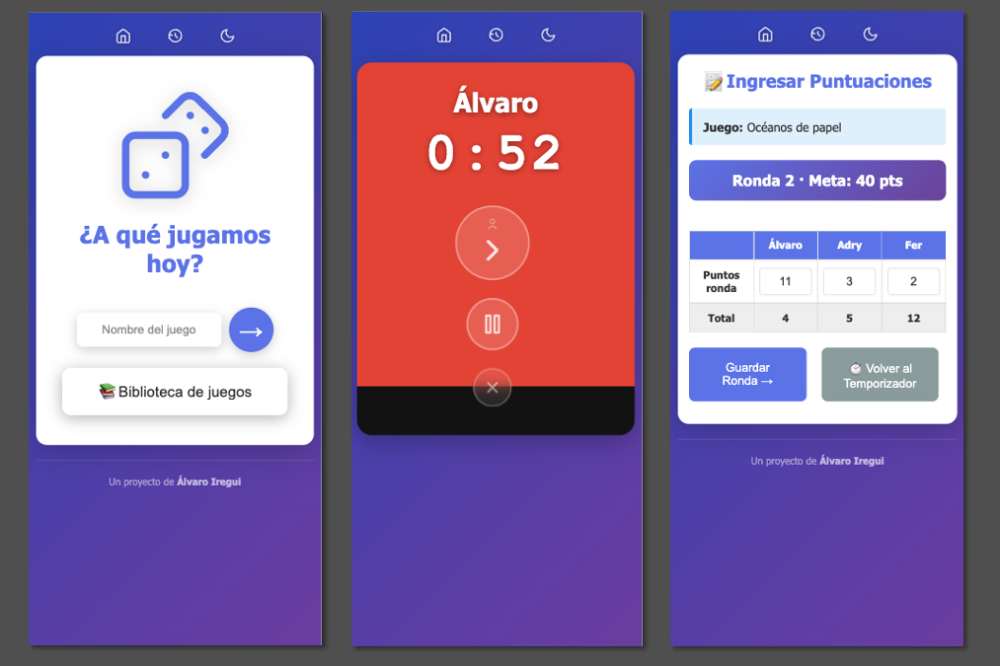
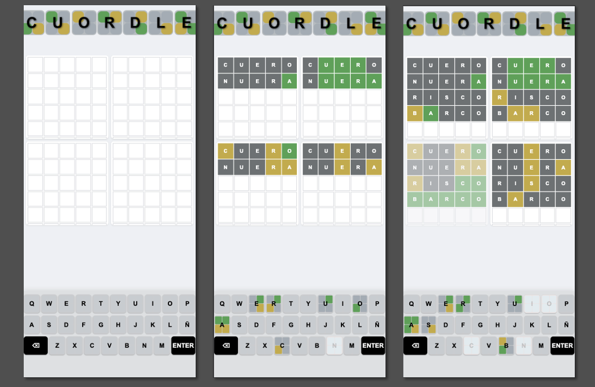

# Proyectos de Álvaro Iregui

¡Hola! Bienvenido a mi repositorio de proyectos de desarrollo web.
Antes de nada, avisarte: no he estudiado programación, estoy aprendiendo poco a poco, construyendo páginas web de proyectos sencillos y tratando de entender cómo funciona todo. 
Me ayudo muchisimo de la IA, de CLaude en concreto.
Las páginas que construyo son, por ejemplo, ideas que alguna vez he pensado "eh, estaría muy bien una app que hiciese esto" o juegos de retos diarios con los que picarme con mi pareja.
Al no tener una base de programación, disfruto aprendiendo lo que se puede hacer, lo que falla y añadiendo mejoras poco a poco intentando no romper lo anterior.

En todos los proyectos, lo que busco es:
* Que sean páginas web, no apps. Que no haga falta descargar nada.
* Que no haya que registrarse.
* Que no haya ningún anuncio.

Aquí puedes ver alguna de las páginas que he creado:
---

## ⏱️ BGTime — Temporizador para juegos de mesa

Con esta aplicación web puedes controlar el tiempo que tiene cada jugador a la hora de echar partidas a juegos de mesa. ¿De dónde surge la idea de hacer esta página? Pues del típico amigo, que todos tenemos, que tarda horas en jugar sus turnos... al final, con los años, le tienes cariño y no le mandas a la mierda, pero el tener un temporizador le mete presión y le hace darse cuenta de que ya vale la broma, que hay que escoger una p**a carta ya y pasar turno.

**Tecnologías:**  
- HTML  
- CSS  
- JavaScript
- 
👉 **[▶️ Probar juego](https://jegomei.github.io/BGTime/)**  
👉 **[📂 Ver repositorio](https://github.com/jegomei/BGTime)**

---

## 🔤 Juego de palabras Quordle en español

Juego tipo Wordle, pero con cuatro palabras a la vez y nueve intentos (Quordle). Mi pareja y yo solíamos jugar en una web, pero quitaron el soporte en español, y otras webs similares que intentamos probar no nos gustaban... así que dejamos de jugar. Un día pensé "oye, que igual con IA se puede hacer un juego web recreando esa idea" y tras unas sesiones... se consiguió. Más o menos. Aún hay que mejorar las palabras que detecta el juego que se pueden usar (todos los adjetivos están en masculino, los verbos sin conjugar...) pero algo es algo. 

**Tecnologías:**  
- HTML  
- CSS  
- JavaScript  

👉 **[▶️ Probar juego](https://jegomei.github.io/Cuardle/)**  
👉 **[📂 Ver repositorio](https://github.com/jegomei/cuordle)**
